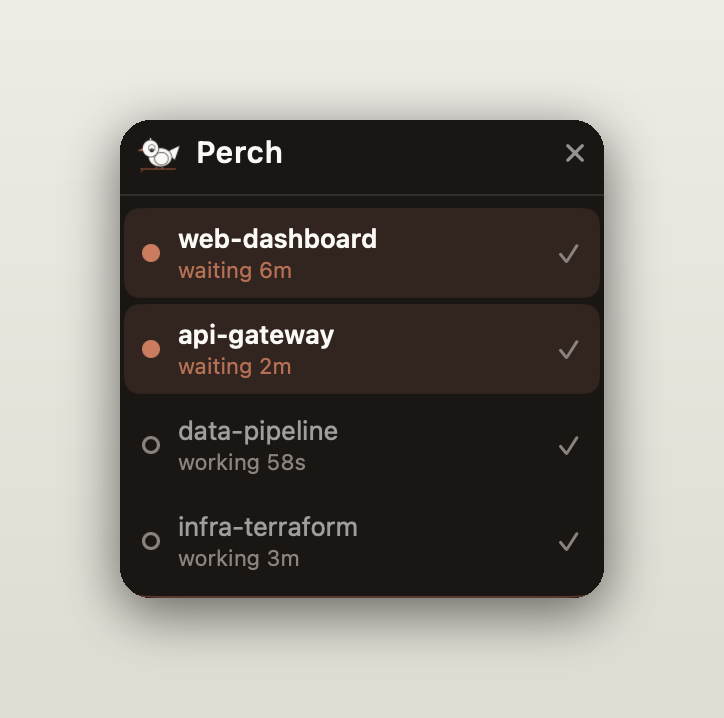
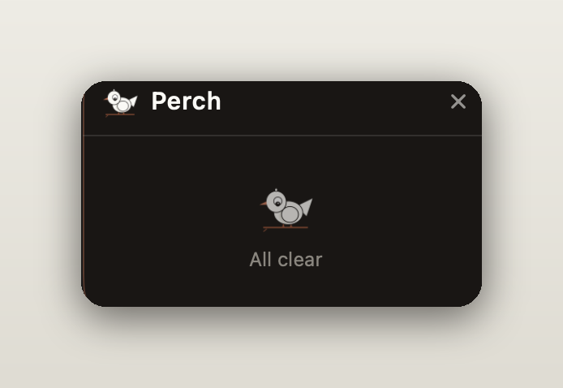

# 🐦 Perch

A native macOS floating mini-window that shows, at a glance, **which Claude Code sessions are waiting on you** — across every terminal you're running — so nothing sits idle waiting for input while you're heads-down elsewhere.

<p align="center">
  
</p>

- **Who's waiting on you** — sorted to the top and coloured Claude-orange. Working sessions sit below in muted grey.
- **Floats over everything** — including another app's native-fullscreen Space — without stealing focus.
- **Alerts you** with a native notification the moment a session goes from working → waiting.
- **Click to jump** straight to the terminal that needs you. First-class for **cmux**; also iTerm2, tmux, and best-effort VS Code.
- **Mark done** to clear a session — it comes back if it does more work and stops again.
- **Stays current** — checks weekly for a new release, with a manual "Check for Updates…" in the menu.

## Install (for users)

1. Download **`Perch-<version>-macos.zip`** from the [latest release](https://github.com/gitLRD/Perch/releases/latest) and unzip it.
2. Open **Terminal**, `cd` into the unzipped `Perch` folder, and run:
   ```bash
   ./install.sh
   ```
   This clears the download quarantine, installs the Claude Code status hooks into `~/.claude/settings.json` (your existing hooks are preserved and a backup is written), moves Perch to `/Applications`, and launches it.
3. Grant notification permission when macOS asks.

> Run `install.sh` from Terminal rather than double-clicking it. Perch is ad-hoc signed (not notarized), so the script clears the quarantine flag for you. To keep it running, add Perch as a Login Item (System Settings → General → Login Items).

**Hooks take effect for _newly started_ Claude Code sessions** — restart a session (or start a new one) to see it appear.

## Using Perch

Look for the 🐦 in your menu bar; the floating panel sits in the top-right corner.

- **Read the states at a glance:**
  - 🟠 **Orange dot — waiting.** This session finished its turn or needs a permission approval; it's on you. Sorted to the top with the elapsed wait ("waiting 4m").
  - ⚪️ **Grey ring — working.** Claude is still thinking or running tools. Dimmed, below the waiting ones.
- **Jump to a session** — click its row. Perch raises the terminal it lives in (switches the cmux surface / focuses the iTerm2 session / selects the tmux pane / opens the VS Code workspace).
- **Mark a session done** — click the ✓ on its row to clear it. If that session later works and stops again, it reappears (a fresh thing needs you).
- **Hide the window** — click the ✕ in the header, or use **Hide Window** from the 🐦 menu. Bring it back with **Show Window** (or ⌘P) from the same menu.
- **Notifications** — when a session newly starts waiting, Perch posts a notification; clicking it jumps you to that session.
- **Move it** — drag the panel anywhere; it remembers where you put it.
- **Updates** — Perch checks for a new release weekly and adds an "Update available" item to the menu when there is one; run **Check for Updates…** anytime. (The check uses the public GitHub releases API, so it's active once the repo is public.)

> **When do sessions appear?** A session shows up the first time it fires a hook *after* you install Perch — i.e. its next turn (a prompt, a stop, or a permission request). Sessions that were already mid-work or sitting idle from before the install stay invisible until they next do something.

<p align="center">
  
</p>

## How it works

Three decoupled pieces talk through the filesystem:

1. **Hooks** (`hooks/`) run on Claude Code's `SessionStart`, `UserPromptSubmit`, `Stop`, `Notification`, and `SessionEnd` events, writing one atomic JSON status file per session to `~/.claude/perch/<session_id>.json` (state, project, pid, host + jump coordinates).
2. **Perch.app** watches `~/.claude/perch/` with FSEvents, renders the floating panel, fires notifications on the working → waiting transition, and drops dead sessions by checking their pid.
3. **The jump dispatcher** raises the right terminal on click. For cmux it resolves `session_id → surface`/`workspace` from cmux's own `~/.cmuxterm/claude-hook-sessions.json` and calls the `cmux` CLI.

## Per-host jump support

| Host       | Behaviour |
|------------|-----------|
| **cmux**   | First-class — focuses the exact surface via the `cmux` CLI. |
| iTerm2     | AppleScript selects the session by `ITERM_SESSION_ID`. |
| tmux       | `tmux select-pane -t <pane>`. |
| VS Code    | Best-effort — opens the workspace folder; a specific integrated-terminal panel isn't reliably targetable. |

## Build from source (developers)

Requires macOS 13+ and the Swift 6 toolchain (Command Line Tools is enough — **no full Xcode**). python3 (ships with macOS) powers the hooks and installer.

```bash
swift run PerchTestRunner        # unit tests
./hooks/tests/run-hook-tests.sh  # hook tests
./scripts/make-icon.sh           # generate the bird icon
./scripts/package-app.sh         # build Perch.app (ad-hoc signed)
./scripts/install-hooks.sh       # wire hooks into ~/.claude/settings.json
open Perch.app
```

`./scripts/make-dist.sh <version>` assembles the self-contained release zip (app + hooks + `install.sh`).

Logic lives in the `PerchCore` library; `Perch` is a thin executable entrypoint. Tests run as a plain executable (`PerchTestRunner`) with a minimal assert harness, because XCTest isn't available under Command Line Tools — add a suite function and call it from `Tests/PerchTests/main.swift`.

## Uninstall

```bash
rm -rf ~/.claude/hooks/perch ~/.claude/perch
# then restore the newest settings backup the installer wrote:
ls ~/.claude/settings.json.perch.bak.*   # copy the newest back over settings.json
```

## License

MIT — see [LICENSE](LICENSE).
